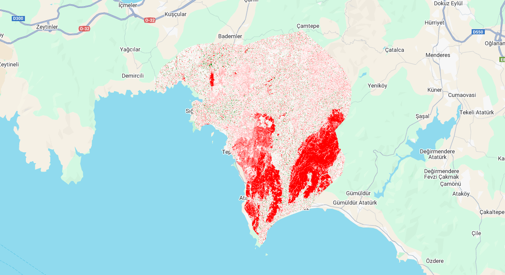
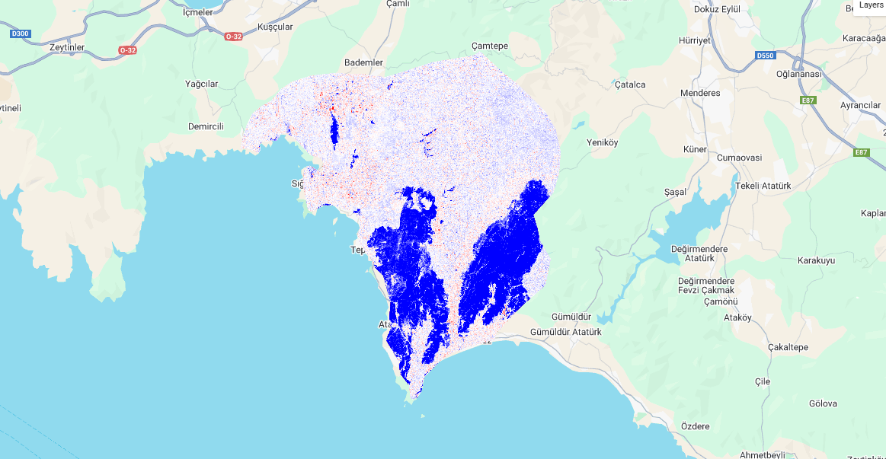

🔍 Project Overview

Goal: Calculate NDVI and NBR before and after a wildfire, compute differences (dNDVI, dNBR), classify burned areas using thresholds, estimate burned area in hectares, and generate maps and summary tables.

For the post-fire analysis, Sentinel-2 images with 15% cloud cover taken between July 3 and July 11 were used. For the pre-fire analysis, Copernicus images with 15% cloud cover taken between June 15 and June 16 were used. The images were obtained through the Google Earth Engine platform, where NDVI and NBR indices were also calculated.

NBR (Normalized Burn Ratio):
• Specifically designed to measure vegetation damage and burn severity after a fire.
• Uses the NIR and SWIR bands.
• Captures spectral responses directly related to fire.
• Distinguishes damaged or burned areas more clearly.

NDVI (Normalized Difference Vegetation Index):
• Indicates general vegetation health and greenness density.
• Uses the NIR and Red bands.
• After a fire, NDVI decreases as greenness is reduced, but it can also be affected by non-fire factors such as drought, disease, or soil properties.
• Its measurements of burned areas may not be as specific as NBR.

- NDVI can vary due to factors like non-fire vegetation stress, irrigation conditions, or soil effects.
- NBR detects fire damage more specifically, so it generally identifies burned areas more accurately.
- Mapping and threshold values may differ (for example, different thresholds may be used for NDVI and NBR).

Key decisions & thresholds (from analysis):

dNDVI thresholds used in the analysis:

• dNDVI < -0.2 -> vegetation loss

• dNDVI < -0.4 -> probable burned area

Pixel area (example from current imagery): ~230.800273 m² (Pixel sizes: X=15.19663938891937 m, Y= -15.199472843208387 m). Use actual raster metadata in scripts.

📊 Example Results

Example findings (from the document):

• NDVI mean before: 0.3698

• NDVI mean after: 0.3185

• dNDVI change: ~0.0513

Estimated burned areas:

• NDVI-based: ~5,077.8 ha

• NBR-based: ~4,479.3 ha

• Difference: ~600 ha (~13–14%) — depends on thresholds and preprocessing.

🧠 Interpretation

The burned area calculated in this study using satellite imagery and vegetation indices (e.g., NBR) was 5,077.8 ha and 4,479.3 ha approximately, compared to the 11000 ha recorded approximately in reality. The difference of 6000 ha (53%) arises from factors such as the spatial resolution of the imagery, the threshold values used in the classification, and the presence of mixed pixels where partially burned and unburned areas coexist. Also, It arises from the nature of the terrain where Seferihisar is located, because if the area is very steep and mountainous, the results can vary quite.

